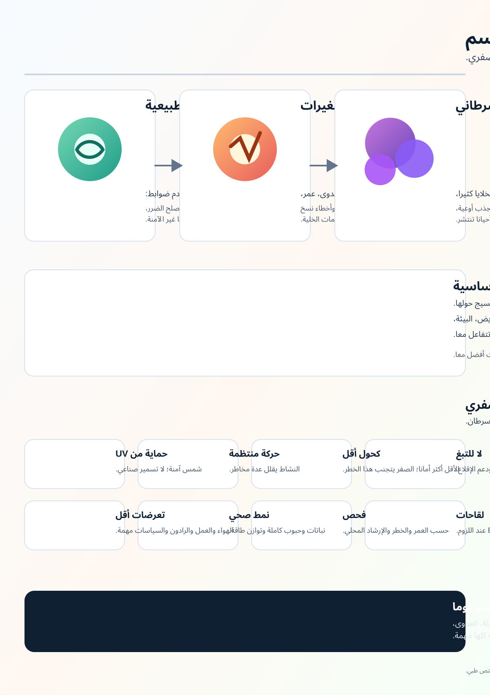

# ويكي أبحاث السرطان

اللغات: [English](../README.md) | [Español](README.es.md) | [Deutsch](README.de.md) | [中文](README.zh.md) | [Русский](README.ru.md) | [Français](README.fr.md) | [Português](README.pt.md) | [العربية](README.ar.md) | [हिन्दी](README.hi.md) | [لغات أخرى](README.md)

Cancer Research Wiki هو ويكي بحثي آلي قائم على الأدلة. هدفه الطويل المدى هو دعم أبحاث السرطان، والتثقيف العام، والوقاية، والتفكير العلاجي باتجاه استئصال السرطان، مع التركيز على الآليات الجذرية وليس الأعراض فقط.

هذه الترجمة هي صفحة دخول. ما زالت الصفحات المصدرية الأساسية باللغة الإنجليزية بينما يتم بناء نسخ متعددة اللغات ومراجعتها.

## الأهداف الرئيسية

### 1. رسم معلوماتي عام عن السرطان

الهدف الأول الكبير هو تحويل الجولة البحثية الأولى الواسعة إلى رسم معلوماتي بصري يمكن أن يفهمه الناس العاديون.

يجب أن يشرح الرسم:

- ما هو السرطان.
- كيف يمكن للخلية الطبيعية أن تصبح سرطانية.
- كيف يواصل السرطان النمو ويتجنب الضوابط الطبيعية.
- كيف يمكن للسرطان أن ينتشر.
- ما عوامل الخطر المدعومة بالأدلة.
- ما إجراءات الوقاية واللقاحات والفحص التي تقلل الخطر على مستوى السكان.
- ما الأشياء التي لا يستطيع الفرد التحكم بها بالكامل.
- متى يجب التحدث مع مختص طبي.

الرسم الحالي:

النص البديل والتعليقات المترجمة: [INFOGRAPHIC_CAPTIONS.md](INFOGRAPHIC_CAPTIONS.md)

## 2. ويكي مناسب لوكلاء متخصصين في السرطان

الهدف الثاني هو ويكي متخصص يساعد الوكلاء على الإجابة عن أسئلة السرطان بمصادر وحدود أمان طبية وتفسيرات آلية.

يجب أن يميز بوضوح بين المعرفة البحثية، ومعلومات الصحة العامة، والنصيحة الطبية الشخصية. لا ينبغي أن يشخص أو يغير العلاج.

## 3. طليعة المعرفة حول mRNA

الهدف الثالث هو بناء قاعدة معرفة متقدمة حول لقاحات وعلاجات mRNA ضد السرطان: المستضدات الجديدة، وأنظمة التوصيل، والتجارب السريرية، والسلامة، والمقاومة، والأدلة حسب نوع السرطان.

لا ينبغي تقديم مفاهيم mRNA التجريبية كعلاجات مثبتة.

## الأدلة والسلامة

يستخدم هذا الويكي مقالات محكمة، ومراجعات منهجية، وتجارب سريرية، ومنظمات مستقلة، ومراكز سرطان، وجمعيات مهنية، ومصادر رسمية كفئة من الأدلة، وليس كسلطة نهائية.

هذا الويكي مخصص للبحث والتعليم. إنه ليس طبيبا. عند وجود أعراض أو أسئلة عن التشخيص أو التوقعات أو العلاج أو المكملات أو التجارب السريرية أو الخطر الشخصي، يجب استشارة مختص صحي.

## مسارات الأدلة

- [README الرئيسي بالإنجليزية](../README.md)
- [أدلة أحجام التأثير](../prevention/effect-size-evidence.md)
- [التواصل حول الخطر](../prevention/risk-communication.md)
- [أمثلة الخطر المطلق خارج الفحص](../prevention/non-screening-absolute-risk-examples.md)
- [إرشادات عامة حول الفحص](../prevention/screening-public-guidance.md)
- [أضرار الفحص والموازنة بينها](../prevention/screening-harms-and-tradeoffs.md)
- [كيف ينمو السرطان](../concepts/how-cancer-grows.md)
- [دليل الوكلاء](../AGENTS.md)
