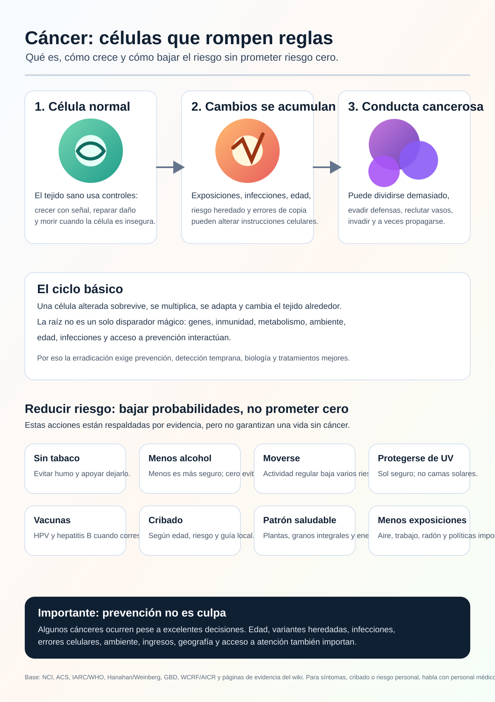

# Wiki de Investigación del Cáncer

Idiomas: [English](../README.md) | [Español](README.es.md) | [Deutsch](README.de.md) | [中文](README.zh.md) | [Русский](README.ru.md)

Cancer Research Wiki es una wiki de investigación automatizada y basada en evidencia. Su intención a largo plazo es ayudar a mover la alfabetización pública, la prevención y el razonamiento terapéutico hacia la erradicación del cáncer, enfocándose en mecanismos de raíz y no solo en síntomas.

Esta traducción es una puerta de entrada. Las páginas fuente principales todavía viven en inglés mientras se construyen versiones multilingües revisadas.

## Objetivos Principales

### 1. Infografía Pública Sobre El Cáncer

El primer gran objetivo es convertir una amplia pasada inicial de investigación en una infografía visual para personas comunes.

La infografía debe explicar:

- Qué es el cáncer.
- Cómo una célula normal puede volverse cancerosa.
- Cómo el cáncer sigue creciendo y evade controles normales.
- Cómo puede propagarse.
- Qué factores de riesgo están respaldados por evidencia.
- Qué prevención, vacunación y detección temprana reducen riesgo a nivel poblacional.
- Qué cosas una persona no puede controlar completamente.
- Cuándo hablar con un profesional médico.

Infografía actual:

Texto alternativo y subtítulos traducidos: [INFOGRAPHIC_CAPTIONS.md](INFOGRAPHIC_CAPTIONS.md)

## 2. Wiki Para Agentes Especialistas En Cáncer

La segunda meta es una wiki diseñada para que agentes respondan preguntas sobre cáncer con rigor, citas, límites de seguridad médica y explicaciones mecanísticas.

Debe separar claramente investigación, salud pública y consejo médico personal. No debe diagnosticar ni cambiar tratamientos.

## 3. Vanguardia En Conocimiento De mRNA

La tercera meta es construir una base de conocimiento de frontera sobre vacunas y terapias de mRNA contra el cáncer: neoantígenos, entrega, ensayos, seguridad, resistencia y evidencia por tipo de cáncer.

Los conceptos experimentales de mRNA no deben presentarse como tratamientos probados.

## Evidencia Y Seguridad

Esta wiki usa artículos revisados por pares, revisiones sistemáticas, ensayos, fuentes independientes, centros oncológicos, sociedades profesionales y fuentes oficiales como una clase de evidencia, no como autoridad final.

Esta wiki es para investigación y educación. No es un médico. Para síntomas, diagnóstico, pronóstico, tratamiento, suplementos, ensayos clínicos o riesgo personal, se debe consultar a un profesional de salud.

## Rutas De Evidencia

- [Guía principal en inglés](../README.md)
- [Evidencia de tamaños de efecto](../prevention/effect-size-evidence.md)
- [Comunicación de riesgo](../prevention/risk-communication.md)
- [Ejemplos de riesgo absoluto sin detección](../prevention/non-screening-absolute-risk-examples.md)
- [Guía pública de detección](../prevention/screening-public-guidance.md)
- [Daños y compensaciones de la detección](../prevention/screening-harms-and-tradeoffs.md)
- [Cómo crece el cáncer](../concepts/how-cancer-grows.md)
- [Guía de agentes](../AGENTS.md)
