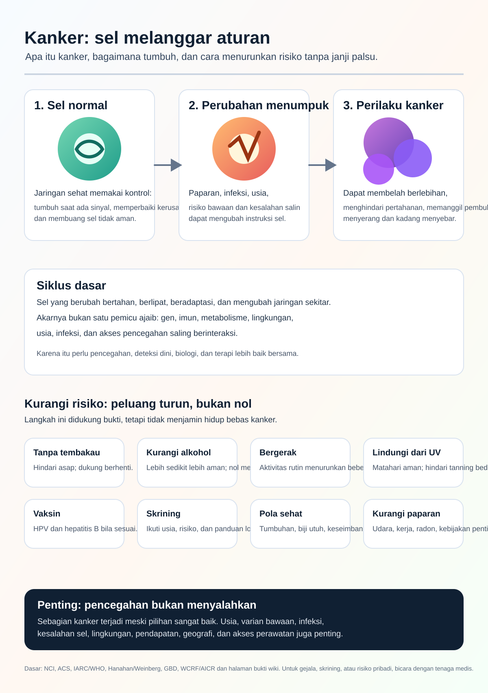

# Wiki Riset Kanker

Bahasa: [English](../README.md) | [Español](README.es.md) | [Deutsch](README.de.md) | [中文](README.zh.md) | [Русский](README.ru.md) | [Français](README.fr.md) | [Português](README.pt.md) | [العربية](README.ar.md) | [हिन्दी](README.hi.md) | [日本語](README.ja.md) | [한국어](README.ko.md) | [Italiano](README.it.md) | [Türkçe](README.tr.md) | [Bahasa Indonesia](README.id.md) | [Tiếng Việt](README.vi.md) | [Bahasa lain](README.md)

Cancer Research Wiki adalah wiki riset otomatis berbasis bukti. Tujuan jangka panjangnya adalah membantu riset kanker, literasi pencegahan, dan penalaran terapi bergerak menuju pemberantasan kanker dengan fokus pada mekanisme akar, bukan hanya gejala.

Halaman ini adalah pintu masuk Bahasa Indonesia. Halaman riset utama tetap menjadi catatan kanonik dalam bahasa Inggris sampai terjemahan ditinjau.

## Tujuan Utama

### 1. Infografik Literasi Kanker Untuk Publik

Tujuan pertama adalah mengubah penelitian awal berskala besar menjadi infografik visual yang dapat dipahami orang sehari-hari.

Infografik harus menjelaskan:

- Apa itu kanker.
- Bagaimana sel normal dapat menjadi kanker.
- Bagaimana kanker terus tumbuh dan menghindari kontrol normal.
- Bagaimana kanker dapat menyebar.
- Faktor risiko mana yang didukung bukti.
- Bagaimana pencegahan, vaksinasi, dan skrining menurunkan risiko pada tingkat populasi.
- Hal apa yang tidak sepenuhnya dapat dikendalikan individu.
- Kapan perlu berbicara dengan tenaga medis.

Infografik saat ini:

Teks alternatif dan keterangan terjemahan: [INFOGRAPHIC_CAPTIONS.md](INFOGRAPHIC_CAPTIONS.md)

## 2. Wiki Spesialis Kanker Yang Ramah Agen

Tujuan kedua adalah wiki khusus yang membantu agen menjawab pertanyaan kanker dengan sumber, batas keamanan medis, penjelasan mekanistik, dan ketidakpastian yang jelas.

Wiki harus memisahkan pengetahuan riset, informasi kesehatan masyarakat, dan nasihat medis pribadi. Wiki ini tidak mendiagnosis dan tidak mengubah pengobatan.

## 3. Garda Depan Pengetahuan mRNA

Tujuan ketiga adalah membangun basis pengetahuan terdepan tentang vaksin dan terapi kanker mRNA: neoantigen, sistem penghantaran, uji klinis, keamanan, resistensi, dan bukti menurut jenis kanker.

Konsep mRNA eksperimental tidak boleh disajikan sebagai pengobatan yang sudah terbukti.

## Bukti Dan Keamanan

Wiki ini menggunakan artikel peer-reviewed, tinjauan sistematis, uji klinis, lembaga riset independen, pusat kanker, organisasi profesional, dan sumber resmi sebagai kategori bukti, bukan sebagai otoritas akhir.

Wiki ini untuk riset dan pendidikan. Ini bukan dokter. Untuk gejala, diagnosis, prognosis, pengobatan, suplemen, uji klinis, atau risiko pribadi, konsultasikan dengan tenaga kesehatan.

## Jalur Bukti

- [README utama bahasa Inggris](../README.md)
- [Bukti ukuran efek](../prevention/effect-size-evidence.md)
- [Komunikasi risiko](../prevention/risk-communication.md)
- [Contoh risiko absolut non-skrining](../prevention/non-screening-absolute-risk-examples.md)
- [Panduan skrining publik](../prevention/screening-public-guidance.md)
- [Bahaya dan tradeoff skrining](../prevention/screening-harms-and-tradeoffs.md)
- [Bagaimana kanker tumbuh](../concepts/how-cancer-grows.md)
- [Panduan agen](../AGENTS.md)
