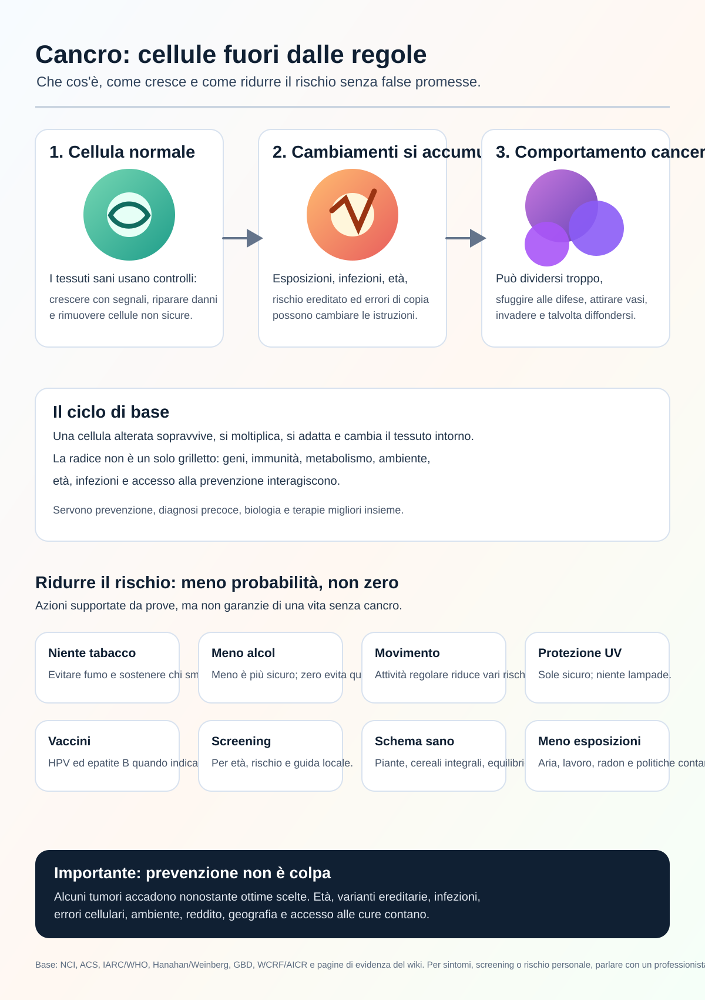

# Wiki di Ricerca Sul Cancro

Lingue: [English](../README.md) | [Español](README.es.md) | [Deutsch](README.de.md) | [中文](README.zh.md) | [Русский](README.ru.md) | [Français](README.fr.md) | [Português](README.pt.md) | [العربية](README.ar.md) | [हिन्दी](README.hi.md) | [日本語](README.ja.md) | [한국어](README.ko.md) | [Italiano](README.it.md) | [Türkçe](README.tr.md) | [Altre lingue](README.md)

Cancer Research Wiki è una wiki di ricerca automatizzata e basata sulle prove. L'obiettivo a lungo termine è aiutare la ricerca, la prevenzione e il ragionamento terapeutico sul cancro a muoversi verso l'eradicazione, concentrandosi sui meccanismi di radice e non solo sui sintomi.

Questa pagina è un ingresso in italiano. Le pagine di ricerca principali restano in inglese finché le traduzioni non saranno revisionate.

## Obiettivi Principali

### 1. Infografica Pubblica Sul Cancro

Il primo obiettivo è trasformare un grande passaggio iniziale di ricerca in una infografica chiara per persone comuni.

L'infografica deve spiegare:

- Che cos'è il cancro.
- Come una cellula normale può diventare cancerosa.
- Come il cancro continua a crescere ed evita i controlli normali.
- Come può diffondersi.
- Quali fattori di rischio hanno prove solide.
- Quali azioni di prevenzione, vaccinazione e screening riducono il rischio a livello di popolazione.
- Che cosa una persona non può controllare completamente.
- Quando parlare con un professionista sanitario.

Infografica attuale:

Testo alternativo e didascalie tradotte: [INFOGRAPHIC_CAPTIONS.md](INFOGRAPHIC_CAPTIONS.md)

## 2. Wiki Per Agenti Specialisti Del Cancro

Il secondo obiettivo è una wiki progettata per aiutare agenti a rispondere a domande sul cancro con fonti, confini di sicurezza medica, spiegazioni meccanicistiche e incertezza chiara.

Deve separare ricerca, salute pubblica e consiglio medico personale. Non deve diagnosticare né modificare trattamenti.

## 3. Avanguardia Della Conoscenza mRNA

Il terzo obiettivo è creare una base di conoscenza avanzata su vaccini e terapie mRNA contro il cancro: neoantigeni, consegna, studi clinici, sicurezza, resistenza ed evidenza per tipo di cancro.

I concetti sperimentali mRNA non devono essere presentati come trattamenti provati.

## Evidenza E Sicurezza

La wiki usa articoli peer-reviewed, revisioni sistematiche, studi clinici, istituti indipendenti, centri oncologici, società professionali e fonti ufficiali come una categoria di evidenza, non come autorità finale.

Questa wiki è per ricerca ed educazione. Non è un medico. Per sintomi, diagnosi, prognosi, trattamento, integratori, studi clinici o rischio personale, consulta un professionista sanitario.

## Percorsi Di Evidenza

- [README principale in inglese](../README.md)
- [Evidenza sugli effect size](../prevention/effect-size-evidence.md)
- [Comunicazione del rischio](../prevention/risk-communication.md)
- [Esempi di rischio assoluto senza screening](../prevention/non-screening-absolute-risk-examples.md)
- [Guida pubblica allo screening](../prevention/screening-public-guidance.md)
- [Danni e tradeoff dello screening](../prevention/screening-harms-and-tradeoffs.md)
- [Come cresce il cancro](../concepts/how-cancer-grows.md)
- [Guida per agenti](../AGENTS.md)
