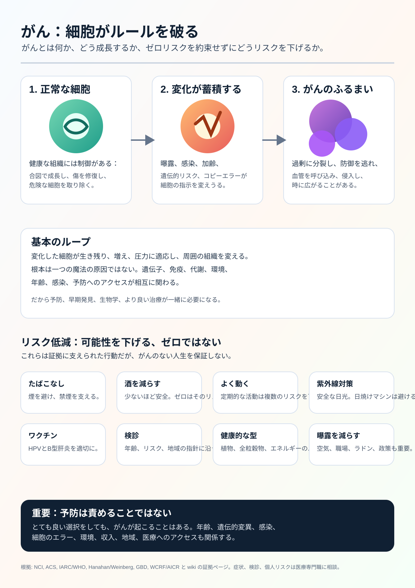

# がん研究ウィキ

言語: [English](../README.md) | [Español](README.es.md) | [Deutsch](README.de.md) | [中文](README.zh.md) | [Русский](README.ru.md) | [Français](README.fr.md) | [Português](README.pt.md) | [العربية](README.ar.md) | [हिन्दी](README.hi.md) | [日本語](README.ja.md) | [한국어](README.ko.md) | [その他の言語](README.md)

Cancer Research Wiki は、自動化された証拠重視の研究ウィキです。長期的な目的は、症状だけでなく根本的な仕組みに注目し、がん研究、予防リテラシー、治療に関する推論を、がんの根絶に近づけることです。

このページは日本語の入口です。主要な研究ページは、レビュー済みの多言語版が整うまで英語を標準記録として維持します。

## 主な目標

### 1. 一般向けがんリテラシー・インフォグラフィック

最初の大きな目標は、大規模な初回研究パスを、一般の人にも理解しやすい視覚的なインフォグラフィックに変えることです。

インフォグラフィックは次を説明します。

- がんとは何か。
- 正常な細胞がどのようにがん化しうるか。
- がんがどのように増殖し、通常の制御を逃れるか。
- がんがどのように広がりうるか。
- どのリスク因子に証拠があるか。
- 予防、ワクチン、検診が集団レベルでどのようにリスクを下げるか。
- 個人が完全には制御できないもの。
- いつ医療専門職に相談すべきか。

現在のインフォグラフィック:

翻訳された代替テキストとキャプション: [INFOGRAPHIC_CAPTIONS.md](INFOGRAPHIC_CAPTIONS.md)

## 2. エージェント向けがん専門ウィキ

第二の目標は、エージェントが出典、医学的安全境界、機序説明、不確実性を保ちながら、がんに関する質問へ有用に答えられる専門ウィキを作ることです。

研究知識、公衆衛生情報、個人向け医療助言を明確に分ける必要があります。このウィキは診断を行わず、治療計画を変更しません。

## 3. mRNA がん知識の最前線

第三の目標は、mRNA がんワクチンと治療に関する先端知識ベースを作ることです。新抗原、送達システム、臨床試験、安全性、抵抗性、がん種別の証拠を追跡します。

実験段階の mRNA 概念を、証明済み治療として提示してはいけません。

## 証拠と安全境界

このウィキは、査読論文、系統的レビュー、臨床試験、独立研究機関、がんセンター、専門学会、公式資料を使います。公式資料は証拠の一種類であり、最終権威ではありません。

このウィキは研究と教育のためのものです。医師ではありません。症状、診断、予後、治療、サプリメント、臨床試験、個人リスクに関する問題では、医療専門職に相談してください。

## 証拠への入口

- [英語のメイン README](../README.md)
- [効果量の証拠](../prevention/effect-size-evidence.md)
- [リスクコミュニケーション](../prevention/risk-communication.md)
- [検診以外の絶対リスク例](../prevention/non-screening-absolute-risk-examples.md)
- [一般向け検診ガイド](../prevention/screening-public-guidance.md)
- [検診の害とトレードオフ](../prevention/screening-harms-and-tradeoffs.md)
- [がんがどのように成長するか](../concepts/how-cancer-grows.md)
- [エージェントガイド](../AGENTS.md)
