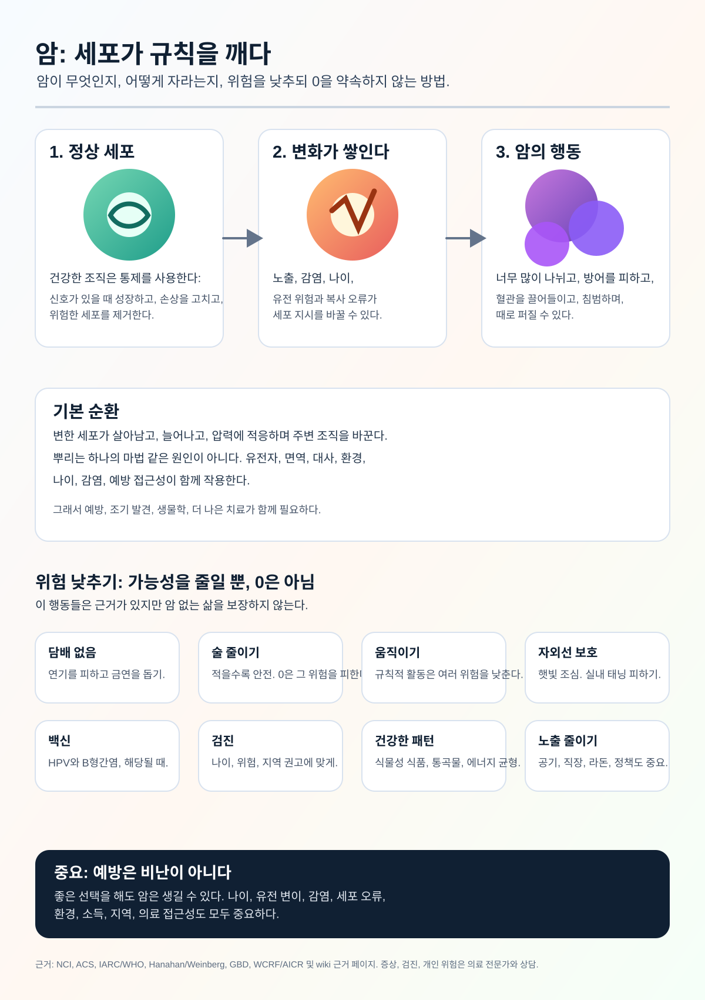

# 암 연구 위키

언어: [English](../README.md) | [Español](README.es.md) | [Deutsch](README.de.md) | [中文](README.zh.md) | [Русский](README.ru.md) | [Français](README.fr.md) | [Português](README.pt.md) | [العربية](README.ar.md) | [हिन्दी](README.hi.md) | [日本語](README.ja.md) | [한국어](README.ko.md) | [더 많은 언어](README.md)

Cancer Research Wiki는 자동화된, 근거 중심의 연구 위키입니다. 장기 목표는 증상만이 아니라 근본 기전에 초점을 맞추어 암 연구, 예방 이해, 치료적 사고를 암 근절에 더 가깝게 만드는 것입니다.

이 페이지는 한국어 입구입니다. 검토된 다국어 버전이 완성될 때까지 핵심 연구 페이지는 영어를 표준 기록으로 유지합니다.

## 주요 목표

### 1. 일반인을 위한 암 이해 인포그래픽

첫 번째 큰 목표는 대규모 첫 연구 패스를 일반인이 이해할 수 있는 시각적 인포그래픽으로 바꾸는 것입니다.

인포그래픽은 다음을 설명해야 합니다.

- 암이 무엇인지.
- 정상 세포가 어떻게 암세포가 될 수 있는지.
- 암이 어떻게 계속 자라고 정상 조절을 피하는지.
- 암이 어떻게 퍼질 수 있는지.
- 어떤 위험 요인이 근거로 뒷받침되는지.
- 예방, 백신, 검진이 집단 수준에서 어떻게 위험을 낮추는지.
- 개인이 완전히 통제할 수 없는 것.
- 언제 의료 전문가와 상담해야 하는지.

현재 인포그래픽:

번역된 대체 텍스트와 캡션: [INFOGRAPHIC_CAPTIONS.md](INFOGRAPHIC_CAPTIONS.md)

## 2. 에이전트 친화적 암 전문 위키

두 번째 목표는 에이전트가 출처, 의학적 안전 경계, 기전 설명, 불확실성을 유지하면서 암 질문에 유용하게 답할 수 있도록 돕는 전문 위키를 만드는 것입니다.

연구 지식, 공중보건 정보, 개인 의료 조언은 명확히 구분되어야 합니다. 이 위키는 진단하지 않으며 치료 계획을 변경하지 않습니다.

## 3. mRNA 암 지식의 선도 기반

세 번째 목표는 mRNA 암 백신과 치료에 대한 최전선 지식 기반을 만드는 것입니다. 신생항원, 전달 시스템, 임상시험, 안전성, 저항성, 암종별 근거를 추적합니다.

실험적 mRNA 개념은 입증된 치료 권고처럼 제시되어서는 안 됩니다.

## 근거와 안전 경계

이 위키는 동료심사 논문, 체계적 문헌고찰, 임상시험, 독립 연구기관, 암 센터, 전문 학회, 공식 자료를 사용합니다. 공식 자료는 근거의 한 종류이지 최종 권위가 아닙니다.

이 위키는 연구와 교육을 위한 것입니다. 의사가 아닙니다. 증상, 진단, 예후, 치료, 보충제, 임상시험, 개인 위험과 관련된 문제는 의료 전문가와 상담해야 합니다.

## 근거 입구

- [영어 메인 README](../README.md)
- [효과 크기 근거](../prevention/effect-size-evidence.md)
- [위험 소통](../prevention/risk-communication.md)
- [검진 외 절대위험 예시](../prevention/non-screening-absolute-risk-examples.md)
- [일반 검진 안내](../prevention/screening-public-guidance.md)
- [검진의 위해와 절충점](../prevention/screening-harms-and-tradeoffs.md)
- [암이 자라는 방식](../concepts/how-cancer-grows.md)
- [에이전트 가이드](../AGENTS.md)
