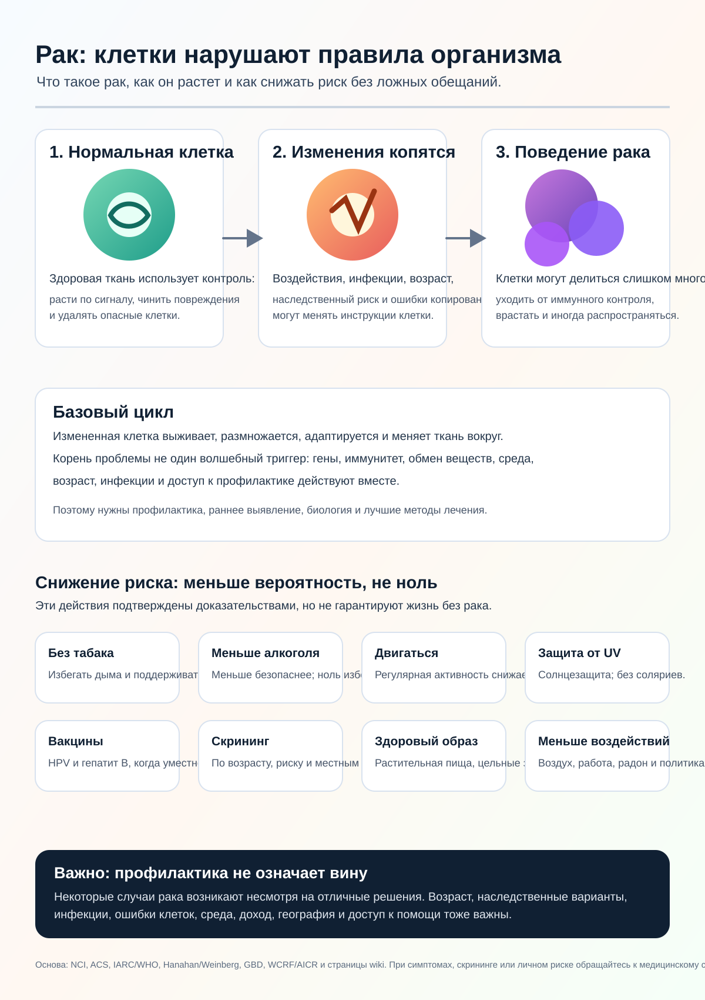

# Вики По Исследованию Рака

Языки: [English](../README.md) | [Español](README.es.md) | [Deutsch](README.de.md) | [中文](README.zh.md) | [Русский](README.ru.md)

Cancer Research Wiki — это автоматизированная исследовательская вики, основанная на доказательствах. Долгосрочная цель — помочь исследованиям рака, общественной грамотности, профилактике и терапевтическому мышлению двигаться к искоренению рака, уделяя внимание корневым механизмам, а не только симптомам.

Этот перевод является входной страницей. Основные исходные материалы пока поддерживаются на английском языке, а проверенные многоязычные версии будут развиваться постепенно.

## Главные Цели

### 1. Публичная Инфографика О Раке

Первая большая цель — превратить широкий первый исследовательский проход в визуальную инфографику для обычных людей.

Инфографика должна объяснять:

- Что такое рак.
- Как нормальная клетка может стать раковой.
- Как рак продолжает расти и избегает нормального контроля.
- Как рак может распространяться.
- Какие факторы риска подтверждены доказательствами.
- Какие меры профилактики, вакцинации и скрининга снижают риск на уровне популяции.
- Что человек не может полностью контролировать.
- Когда нужно обратиться к медицинскому специалисту.

Текущая инфографика:

Переведенные подписи и альтернативный текст: [INFOGRAPHIC_CAPTIONS.md](INFOGRAPHIC_CAPTIONS.md)

## 2. Вики Для Агентов-Специалистов По Раку

Вторая цель — создать вики, которая помогает агентам отвечать на вопросы о раке с источниками, медицинскими границами безопасности и механистическими объяснениями.

Она должна четко отделять исследовательские знания, общественное здравоохранение и личные медицинские советы. Она не должна ставить диагнозы или изменять лечение.

## 3. Передовой Уровень Знаний О mRNA

Третья цель — создать передовую базу знаний по mRNA-вакцинам и терапиям против рака: неоантигены, доставка, клинические испытания, безопасность, резистентность и доказательства по типам рака.

Экспериментальные mRNA-концепции нельзя представлять как доказанные методы лечения.

## Доказательства И Безопасность

Вики использует рецензируемые статьи, систематические обзоры, клинические испытания, независимые организации, онкологические центры, профессиональные общества и официальные источники как один из классов доказательств, а не как окончательный авторитет.

Эта вики предназначена для исследований и образования. Это не врач. При симптомах, диагнозе, прогнозе, лечении, добавках, клинических испытаниях или личном риске нужно обращаться к медицинскому специалисту.

## Пути К Доказательствам

- [Главный README на английском](../README.md)
- [Доказательства размеров эффекта](../prevention/effect-size-evidence.md)
- [Коммуникация риска](../prevention/risk-communication.md)
- [Примеры абсолютного риска без скрининга](../prevention/non-screening-absolute-risk-examples.md)
- [Публичное руководство по скринингу](../prevention/screening-public-guidance.md)
- [Вред и компромиссы скрининга](../prevention/screening-harms-and-tradeoffs.md)
- [Как растет рак](../concepts/how-cancer-grows.md)
- [Руководство для агентов](../AGENTS.md)
