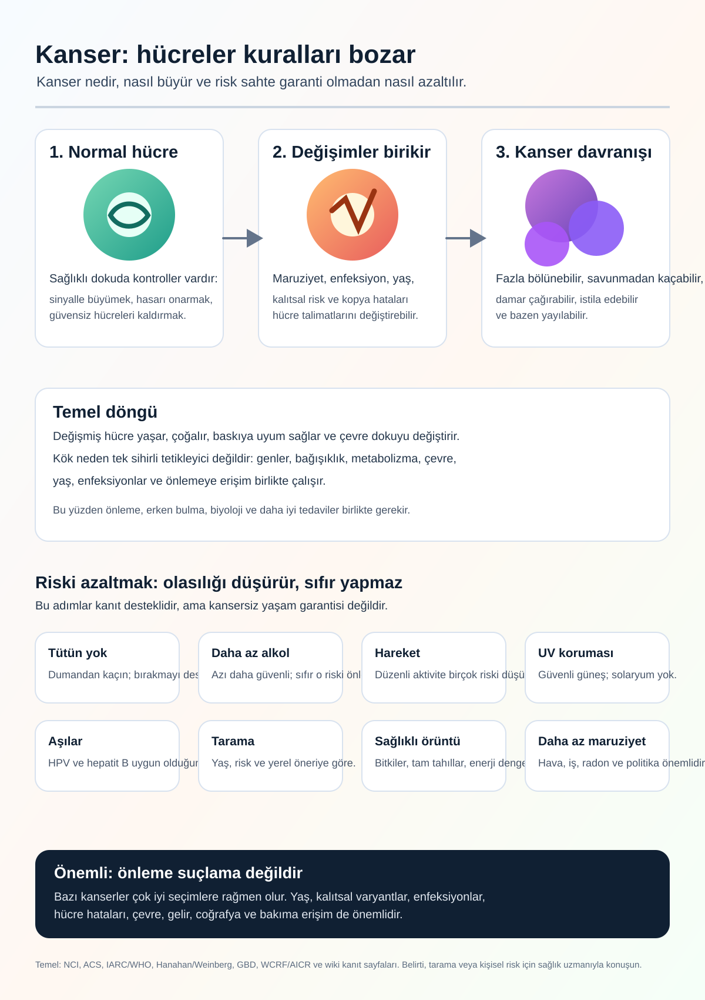

# Kanser Araştırma Vikisi

Diller: [English](../README.md) | [Español](README.es.md) | [Deutsch](README.de.md) | [中文](README.zh.md) | [Русский](README.ru.md) | [Français](README.fr.md) | [Português](README.pt.md) | [العربية](README.ar.md) | [हिन्दी](README.hi.md) | [日本語](README.ja.md) | [한국어](README.ko.md) | [Italiano](README.it.md) | [Türkçe](README.tr.md) | [Diğer diller](README.md)

Cancer Research Wiki, otomatik ve kanıta dayalı bir araştırma vikisidir. Uzun vadeli amaç, yalnızca belirtilere değil kök mekanizmalara odaklanarak kanser araştırmasını, önleme okuryazarlığını ve tedavi akıl yürütmesini kanseri ortadan kaldırmaya yaklaştırmaktır.

Bu sayfa Türkçe bir giriş noktasıdır. Gözden geçirilmiş çok dilli sürümler tamamlanana kadar ana araştırma sayfaları İngilizce kanonik kayıt olarak kalır.

## Ana Hedefler

### 1. Halk İçin Kanser Okuryazarlığı İnfografiği

İlk büyük hedef, geniş ilk araştırma geçişini herkesin anlayabileceği görsel bir infografiğe dönüştürmektir.

İnfografik şunları açıklamalıdır:

- Kanser nedir.
- Normal bir hücre nasıl kanserleşebilir.
- Kanser nasıl büyümeyi sürdürür ve normal kontrollerden kaçar.
- Nasıl yayılabilir.
- Hangi risk faktörleri kanıtla desteklenir.
- Önleme, aşı ve tarama adımları toplum düzeyinde riski nasıl düşürür.
- Kişinin tamamen kontrol edemediği şeyler.
- Ne zaman bir sağlık uzmanıyla konuşmak gerekir.

Mevcut infografik:

Çevrilmiş alternatif metin ve açıklamalar: [INFOGRAPHIC_CAPTIONS.md](INFOGRAPHIC_CAPTIONS.md)

## 2. Ajan Dostu Kanser Uzmanı Vikisi

İkinci hedef, ajanların kanser sorularını kaynaklarla, tıbbi güvenlik sınırlarıyla, mekanizma açıklamalarıyla ve açık belirsizlikle yanıtlamasına yardım eden özel bir vikidir.

Araştırma bilgisi, halk sağlığı bilgisi ve kişisel tıbbi tavsiye açıkça ayrılmalıdır. Bu viki tanı koymaz ve tedavileri değiştirmez.

## 3. mRNA Kanser Bilgisinde Öncülük

Üçüncü hedef, mRNA kanser aşıları ve tedavileri hakkında öncü bir bilgi tabanı oluşturmaktır: neoantijenler, taşıma sistemleri, klinik çalışmalar, güvenlik, direnç ve kanser tipine göre kanıt.

Deneysel mRNA kavramları kanıtlanmış tedavi önerileri gibi sunulmamalıdır.

## Kanıt Ve Güvenlik

Bu viki hakemli makaleler, sistematik incelemeler, klinik çalışmalar, bağımsız araştırma kurumları, kanser merkezleri, meslek örgütleri ve resmi kaynakları kanıt sınıfları olarak kullanır. Resmi kaynaklar nihai otorite değildir.

Bu viki araştırma ve eğitim içindir. Doktor değildir. Belirti, tanı, prognoz, tedavi, takviye, klinik çalışma veya kişisel risk konularında sağlık uzmanına danışılmalıdır.

## Kanıt Yolları

- [Ana İngilizce README](../README.md)
- [Etki büyüklüğü kanıtları](../prevention/effect-size-evidence.md)
- [Risk iletişimi](../prevention/risk-communication.md)
- [Tarama dışı mutlak risk örnekleri](../prevention/non-screening-absolute-risk-examples.md)
- [Halk için tarama rehberi](../prevention/screening-public-guidance.md)
- [Tarama zararları ve dengeleri](../prevention/screening-harms-and-tradeoffs.md)
- [Kanser nasıl büyür](../concepts/how-cancer-grows.md)
- [Ajan rehberi](../AGENTS.md)
