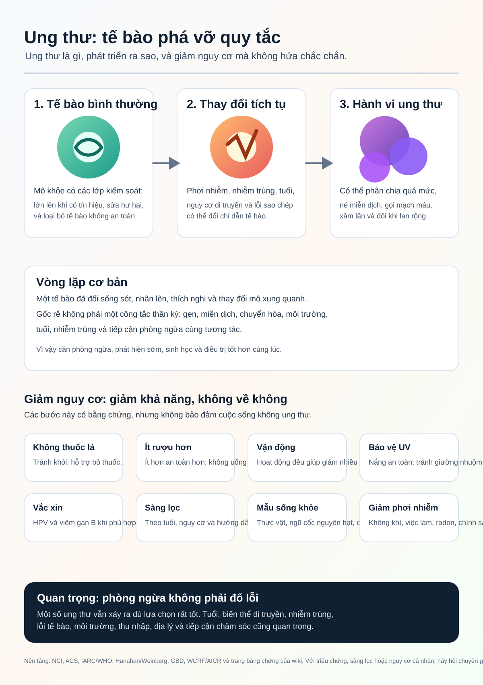

# Wiki Nghiên Cứu Ung Thư

Ngôn ngữ: [English](../README.md) | [Español](README.es.md) | [Deutsch](README.de.md) | [中文](README.zh.md) | [Русский](README.ru.md) | [Français](README.fr.md) | [Português](README.pt.md) | [العربية](README.ar.md) | [हिन्दी](README.hi.md) | [日本語](README.ja.md) | [한국어](README.ko.md) | [Italiano](README.it.md) | [Türkçe](README.tr.md) | [Bahasa Indonesia](README.id.md) | [Tiếng Việt](README.vi.md) | [Ngôn ngữ khác](README.md)

Cancer Research Wiki là một wiki nghiên cứu tự động, đặt bằng chứng làm trung tâm. Mục tiêu dài hạn là giúp nghiên cứu ung thư, hiểu biết phòng ngừa và suy luận điều trị tiến gần hơn tới việc loại trừ ung thư bằng cách tập trung vào cơ chế gốc, không chỉ triệu chứng.

Trang này là lối vào tiếng Việt. Các trang nghiên cứu chính vẫn là bản ghi chuẩn bằng tiếng Anh cho đến khi các bản dịch được rà soát.

## Mục Tiêu Chính

### 1. Infographic Hiểu Biết Ung Thư Cho Công Chúng

Mục tiêu đầu tiên là biến lượt nghiên cứu ban đầu lớn thành một infographic trực quan cho người bình thường.

Infographic cần giải thích:

- Ung thư là gì.
- Tế bào bình thường có thể trở thành ung thư như thế nào.
- Ung thư tiếp tục phát triển và né kiểm soát bình thường ra sao.
- Ung thư có thể lan rộng như thế nào.
- Yếu tố nguy cơ nào được bằng chứng ủng hộ.
- Phòng ngừa, vắc xin và sàng lọc giảm nguy cơ ở cấp độ dân số ra sao.
- Những điều cá nhân không thể kiểm soát hoàn toàn.
- Khi nào cần nói chuyện với chuyên gia y tế.

Infographic hiện tại:

Văn bản thay thế và chú thích đã dịch: [INFOGRAPHIC_CAPTIONS.md](INFOGRAPHIC_CAPTIONS.md)

## 2. Wiki Chuyên Gia Ung Thư Thân Thiện Với Agent

Mục tiêu thứ hai là một wiki chuyên biệt giúp agent trả lời câu hỏi về ung thư với nguồn trích dẫn, ranh giới an toàn y tế, giải thích cơ chế và ghi rõ bất định.

Wiki phải tách bạch kiến thức nghiên cứu, thông tin y tế công cộng và lời khuyên y tế cá nhân. Wiki này không chẩn đoán và không thay đổi điều trị.

## 3. Tầng Tri Thức mRNA Tiên Phong

Mục tiêu thứ ba là xây dựng nền tảng tri thức tiên phong về vắc xin và liệu pháp mRNA cho ung thư: neoantigen, hệ đưa thuốc, thử nghiệm lâm sàng, an toàn, kháng trị và bằng chứng theo loại ung thư.

Các ý tưởng mRNA thử nghiệm không được trình bày như điều trị đã được chứng minh.

## Bằng Chứng Và An Toàn

Wiki dùng bài báo bình duyệt, tổng quan hệ thống, thử nghiệm lâm sàng, viện nghiên cứu độc lập, trung tâm ung thư, hội chuyên môn và nguồn chính thức như các loại bằng chứng, không phải quyền lực cuối cùng.

Wiki này dành cho nghiên cứu và giáo dục. Nó không phải bác sĩ. Với triệu chứng, chẩn đoán, tiên lượng, điều trị, thực phẩm bổ sung, thử nghiệm lâm sàng hoặc nguy cơ cá nhân, hãy hỏi chuyên gia y tế.

## Lối Vào Bằng Chứng

- [README tiếng Anh chính](../README.md)
- [Bằng chứng về cỡ hiệu ứng](../prevention/effect-size-evidence.md)
- [Truyền thông nguy cơ](../prevention/risk-communication.md)
- [Ví dụ nguy cơ tuyệt đối ngoài sàng lọc](../prevention/non-screening-absolute-risk-examples.md)
- [Hướng dẫn sàng lọc cho công chúng](../prevention/screening-public-guidance.md)
- [Tác hại và đánh đổi của sàng lọc](../prevention/screening-harms-and-tradeoffs.md)
- [Ung thư phát triển như thế nào](../concepts/how-cancer-grows.md)
- [Hướng dẫn agent](../AGENTS.md)
