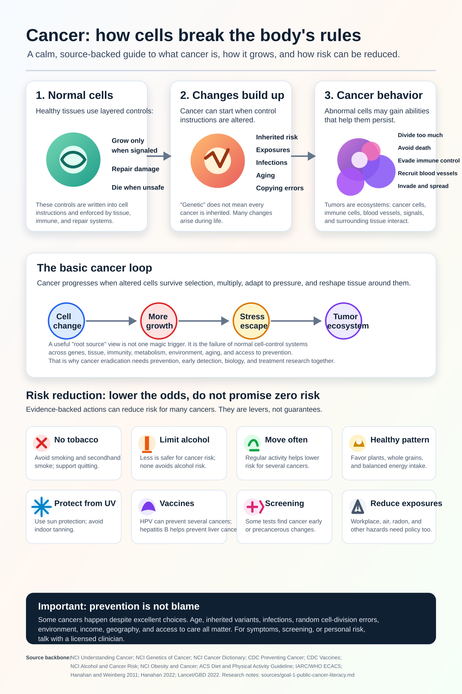

# 癌症研究维基

语言：[English](../README.md) | [Español](README.es.md) | [Deutsch](README.de.md) | [中文](README.zh.md) | [Русский](README.ru.md)

Cancer Research Wiki 是一个自动化、以证据为核心的研究型维基。长期目标是帮助癌症研究、公众科普、预防知识和治疗推理走向消除癌症，重点关注根源机制，而不仅仅是症状。

本页是中文入口。主要源页面目前仍以英文维护，之后会逐步建立经过审查的多语言版本。

## 主要目标

### 1. 面向公众的癌症科普信息图

第一个主要目标是把大规模第一轮研究转化为一张普通人也能理解的高视觉化信息图。

信息图应解释：

- 癌症是什么。
- 正常细胞如何变成癌细胞。
- 癌症如何持续生长并逃避正常控制。
- 癌症如何扩散。
- 哪些风险因素有证据支持。
- 哪些预防、疫苗接种和筛查可以在群体层面降低风险。
- 哪些因素个人无法完全控制。
- 什么时候应该咨询医疗专业人员。

当前信息图：

## 2. 适合智能体使用的癌症专家维基

第二个目标是建立一个专门的维基，让智能体能够用有来源、有医学安全边界、有机制解释的方式回答癌症问题。

它必须清楚地区分研究知识、公共卫生信息和个人医疗建议。它不能诊断疾病，也不能修改治疗方案。

## 3. mRNA 癌症知识前沿

第三个目标是成为 mRNA 癌症疫苗和治疗的前沿知识库：新抗原、递送系统、临床试验、安全性、耐药机制以及不同癌种的证据。

实验性 mRNA 概念不能被描述为已经证实有效的治疗建议。

## 证据与安全边界

本维基使用同行评审论文、系统综述、临床试验、独立研究机构、癌症中心、专业学会以及官方资料。官方资料只是证据来源之一，不是最终权威。

本维基用于研究和教育，不是医生。涉及症状、诊断、预后、治疗、补充剂、临床试验或个人风险时，应咨询医疗专业人员。

## 证据入口

- [英文主 README](../README.md)
- [效应大小证据](../prevention/effect-size-evidence.md)
- [风险沟通指南](../prevention/risk-communication.md)
- [非筛查绝对风险示例](../prevention/non-screening-absolute-risk-examples.md)
- [公众筛查指南](../prevention/screening-public-guidance.md)
- [筛查伤害与权衡](../prevention/screening-harms-and-tradeoffs.md)
- [癌症如何生长](../concepts/how-cancer-grows.md)
- [智能体指南](../AGENTS.md)
