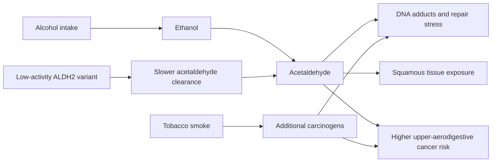

# Alcohol, ALDH2, Tobacco, And Upper Aerodigestive Cancer

Status: focused Goal 1 crawl synthesis
Last updated: 2026-06-12

This page deepens `prevention/alcohol-and-cancer-evidence.md` for cancers of the oral cavity, pharynx, larynx, and esophagus. It is especially important for multilingual and global public literacy because ALDH2 loss-of-function variants are common in East Asian populations, while tobacco-plus-alcohol risk is globally relevant.

## Plain-Language Takeaway

Alcohol can raise cancer risk partly because the body converts ethanol into acetaldehyde, a DNA-damaging chemical. Most people clear acetaldehyde through aldehyde dehydrogenase enzymes, especially ALDH2. Some people inherit an ALDH2 variant that clears acetaldehyde poorly. For them, drinking can produce facial flushing and higher acetaldehyde exposure.

Public message:

- Facial flushing after alcohol can be a warning sign, not proof of harmless "low tolerance."
- People who flush and keep drinking, especially moderate-to-heavy drinking, may have higher esophageal squamous cell carcinoma risk.
- Tobacco and alcohol together are especially dangerous for cancers of the mouth, throat, voice box, and esophagus.
- This should be communicated without ethnic stereotyping, genetic determinism, or personal blame.

## Why This Matters For Goal 1

The first infographic needs to tell everyday humans what can steer life toward lower cancer risk. ALDH2 and tobacco-plus-alcohol evidence adds nuance:

- Same exposure, different biology: inherited metabolism can change acetaldehyde burden.
- Same behavior, different context: tobacco can amplify alcohol-related upper-aerodigestive risk.
- Prevention is not one-size-fits-all: some people and populations need clearer alcohol risk messaging.

## Mechanistic Model

Use this model as an educational simplification. Real risk depends on dose, duration, smoking history, diet, oral health, infections, socioeconomic factors, and screening or diagnostic access.

## Evidence Anchors

| Topic | Evidence anchor | Public meaning | Caution |
| --- | --- | --- | --- |
| Alcohol flushing and ESCC | A 2016 meta-analysis of seven studies reported ESCC OR 1.97 for alcohol flushing overall, OR 2.54 among moderate drinkers with flushing, and OR 2.90 among heavy drinkers with flushing compared with drinkers without flushing. | Flushing can identify a group with higher alcohol-related ESCC risk. | Flushing is an imperfect proxy for ALDH2 genotype; heterogeneity was high. |
| ALDH2 genotype and esophageal cancer | A review summarizing Zhao et al. reported ALDH2*1/*2 OR 2.34 for esophageal cancer overall and stronger associations with alcohol intake: light drinker OR 3.79 and heavy drinker OR 6.50 versus ALDH2*1/*1. | Genetic acetaldehyde clearance can modify alcohol cancer risk. | Mostly case-control evidence; avoid personal genotype interpretation without clinical context. |
| East Asian burden modeling | A 2023 systematic review/meta-analysis/modeling study reported that liver, esophageal, and oral cavity/pharynx alcohol-attributable cancer burden in East Asia may be underestimated when ALDH2 polymorphism is ignored. | Population estimates can miss biology that is unevenly distributed across ancestry groups. | Modeling depends on genotype prevalence, exposure estimates, cancer registries, and dose-response assumptions. |
| Tobacco plus alcohol | INHANCE pooled head and neck cancer analysis reported a population-attributable risk of 72% for tobacco or alcohol, with 4% alcohol alone, 33% tobacco alone, and 35% due to their overlap. | The combined exposure matters; quitting either lever helps, avoiding both helps most. | Population-attributable fractions are not personal blame and vary by population. |
| Upper aerodigestive cancers review | Reviews describe alcohol and tobacco as major risk factors for upper aerodigestive tract cancers, with combined exposure accounting for a large share of cases in many settings. | Mouth, throat, larynx, and esophagus prevention should not separate alcohol and tobacco too cleanly. | "Upper aerodigestive" groups several cancer sites with different baseline risks. |

## Public Wording

Good:

- "If your face flushes after alcohol, that may signal slower acetaldehyde clearance. Drinking less or not drinking is the safer cancer-prevention direction."
- "Alcohol and tobacco together can raise risk more than either exposure alone for cancers of the mouth, throat, voice box, and esophagus."
- "This is about biology and exposure, not blame or identity."

Avoid:

- "Asian flush protects you from drinking."
- "Only East Asian people need to worry about alcohol."
- "A flushing response diagnoses your genotype."
- "If you drink and smoke, cancer is inevitable."

## Agent Answer Template

When asked about flushing after alcohol:

1. Explain that flushing often reflects acetaldehyde buildup from low ALDH2 activity, especially but not only in East Asian ancestry groups.
2. State that acetaldehyde is a carcinogenic alcohol metabolite and that studies link flushing plus drinking to higher esophageal squamous cell carcinoma risk.
3. Add that tobacco plus alcohol is especially concerning for upper aerodigestive cancers.
4. Avoid genetic certainty unless the user has a validated test result.
5. Encourage a clinician conversation for symptoms such as trouble swallowing, persistent hoarseness, unexplained weight loss, blood, lumps, or long-lasting mouth/throat lesions.

Example:

> Facial flushing after alcohol can mean your body is clearing acetaldehyde slowly. Acetaldehyde is one reason alcohol can raise cancer risk, especially for esophageal squamous cell carcinoma and other upper-aerodigestive cancers. The safest cancer-prevention direction is drinking less or not drinking, and avoiding tobacco is especially important because alcohol and tobacco can act together.

## Source Cards

### Andrici et al. 2016: Alcohol Flushing And ESCC Meta-Analysis

- URL: https://pubmed.ncbi.nlm.nih.gov/26618333/
- DOI: https://doi.org/10.1016/j.canep.2015.10.011
- PMID: 26618333
- Source type: systematic review and meta-analysis
- Reusable claims:
  - Alcohol flushing response was associated with higher ESCC risk in pooled analysis.
  - The association was stronger among moderate and heavy drinkers who flushed compared with moderate and heavy drinkers who did not flush.
- Caution:
  - Flushing response is a proxy, not a clinical genotype test, and heterogeneity was substantial.

### Chang et al. 2017: ALDH2 And Alcohol-Related Cancers In Asians

- URL: https://link.springer.com/article/10.1186/s12929-017-0327-y
- Source type: peer-reviewed review
- Reusable claims:
  - ALDH2 is central to acetaldehyde clearance after alcohol intake.
  - ALDH2 polymorphism can modify alcohol-associated cancer risk, particularly for esophageal and head-and-neck cancers.
  - The review summarizes meta-analytic evidence that ALDH2*1/*2 risk strengthens with alcohol intake for esophageal cancer.
- Caution:
  - The review integrates heterogeneous studies; use original meta-analyses when a precise estimate is needed.

### Ng et al. 2023: East Asian Alcohol-Attributable Burden With ALDH2

- URL: https://pubmed.ncbi.nlm.nih.gov/37268241/
- DOI: https://doi.org/10.1016/j.annepidem.2023.05.013
- Source type: systematic review, meta-analysis, and modeling study
- Reusable claims:
  - Alcohol-attributable liver, esophageal, and oral cavity/pharynx cancer burden in East Asia may be underestimated when ALDH2 genotype-specific risk is not considered.
  - The analysis focused on China, Japan, and South Korea.
- Caution:
  - Treat as population modeling, not individual prediction.

### Hashibe et al. 2009: Tobacco, Alcohol, And Head/Neck Cancer Interaction

- URL: https://pmc.ncbi.nlm.nih.gov/articles/PMC3051410/
- PubMed: https://pubmed.ncbi.nlm.nih.gov/18562959/
- Source type: pooled case-control analysis, INHANCE consortium
- Reusable claims:
  - Tobacco and alcohol jointly account for a large attributable share of head and neck cancer in the pooled analysis.
  - The overlap of tobacco and alcohol exposure accounted for a substantial fraction of population-attributable risk.
- Caution:
  - Case-control pooling improves power but remains observational; population fractions depend on local exposure prevalence.

### Pelucchi et al. 2008: Alcohol, Tobacco, And Upper Aerodigestive Cancer Review

- URL: https://pubmed.ncbi.nlm.nih.gov/18562959/
- Source type: peer-reviewed review
- Reusable claims:
  - Alcohol drinking and tobacco smoking are major risk factors for upper aerodigestive tract cancers.
  - Combined exposure accounts for a large share of cases in many developed-country datasets.
- Caution:
  - The review predates HPV-era shifts for oropharyngeal cancer; keep HPV-related oropharyngeal cancer distinct.

## Open Questions For Later Crawls

- Add ALDH2 allele frequency and alcohol-use prevalence by country, with careful ancestry wording.
- Add source cards for ADH1B plus ALDH2 joint genotype evidence.
- Add esophageal squamous cell carcinoma screening or early-detection evidence in high-risk East Asian groups.
- Add tobacco cessation and alcohol reduction intervention evidence specific to head/neck and esophageal cancer survivors.
- Add culturally safe public wording in Japanese, Korean, Mandarin, and other languages.
